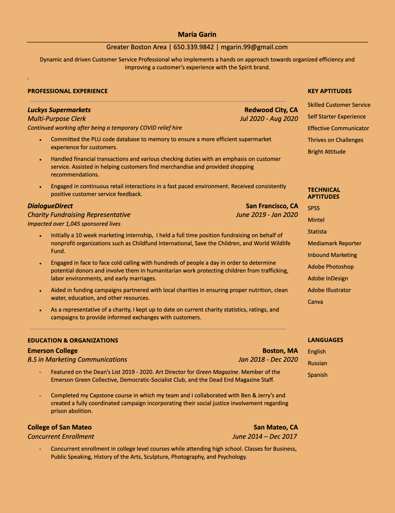

# About

#### Hi! My name is Maria Garin and I'm a recent graduate of Emerson College's 2020 class. 

I held a focus in marketing and was featured on the Dean's list in 2019 and 2020. 

My time at Emerson College sparked many passions including BEE, an organization dedicated to honeybee conservation campaigns and education. Among being one of the founding members of BEE, I was a member of my school's Green Collective of environmental clubs. Together we published Green Magazine, Emerson's sole environmental publication, of which I was Art Director. 

[Spring 2018 Green Publication](https://issuu.com/emersongreen/docs/green.2018.1)

[Fall 2018 Green Publication](https://issuu.com/emersongreen/docs/green_vol_2__1_)

[Fall 2019 Green Publication](https://issuu.com/emersongreen/docs/green-digital)

