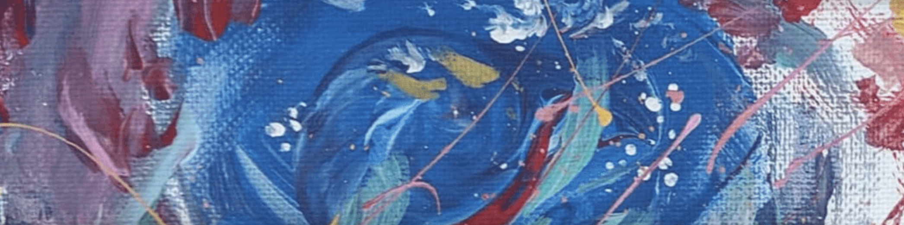

<b> Freelance Design </b>

Aside from traditional illustration, I am skilled in Adobe Photoshop, Adobe Illustrator, Adobe Indesign, Canva, and PixlR.

My freelance illustration and design portfolio is available on my instagram at <a style={{color: "#f2ffb8"}} target='_blank' href='https://www.instagram.com/chippedlore/'>@chippedlore</a>. While you're here, check out a preview.   

import Instagram from "../../../src/components/instagram";

<h1 className="visuallyHidden" data-testid="page-title">
  Instagram
</h1>

<Instagram />