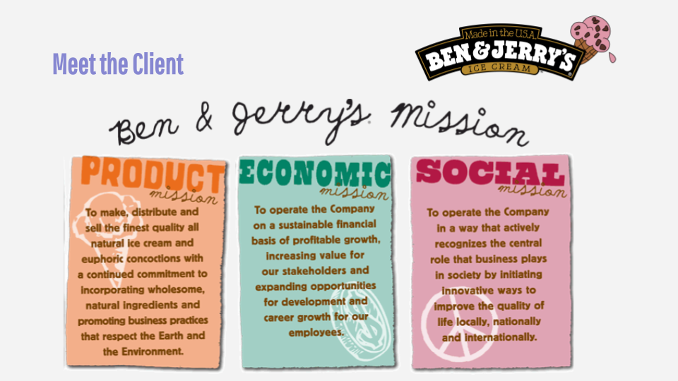

My Capstone project was a collaboration with Ben & Jerry's, who are known for their delicious ice cream and their commitment to social justice. My team and I created a campaign introducing a new flavor for their involvement in the prison abolition movement. Serving as the Experiental & PR Director, I helped develop a cohesive brand experience through the campaign's planned media exposure and events. 

